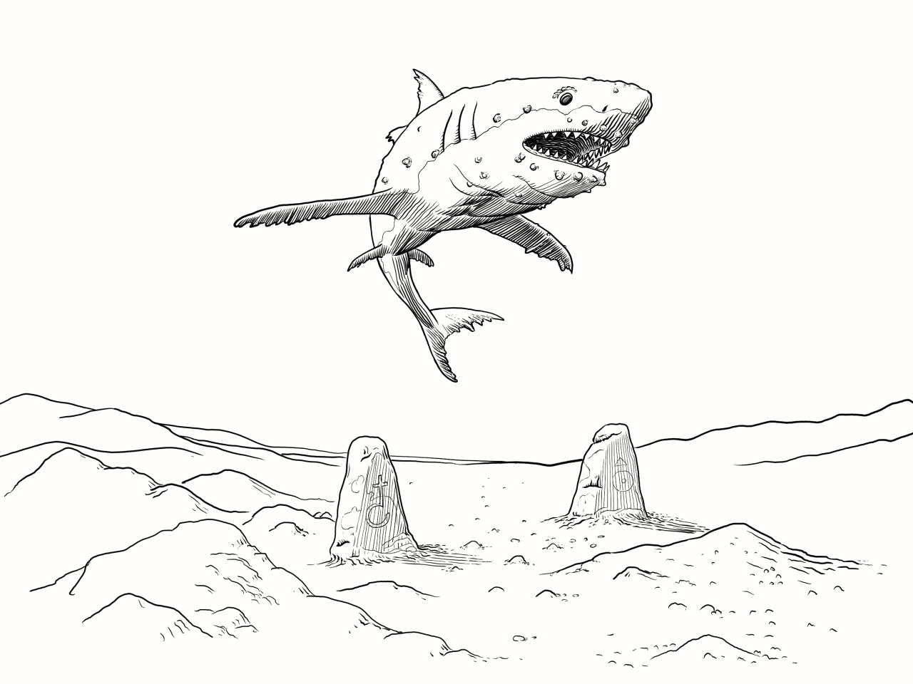
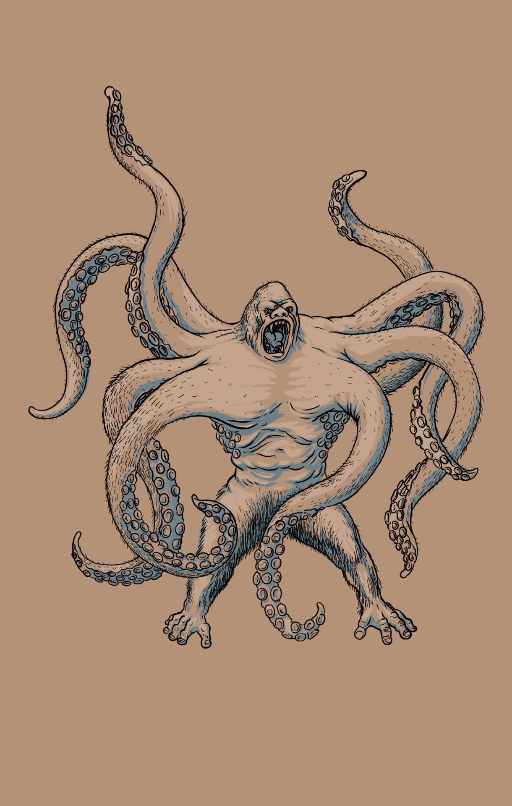
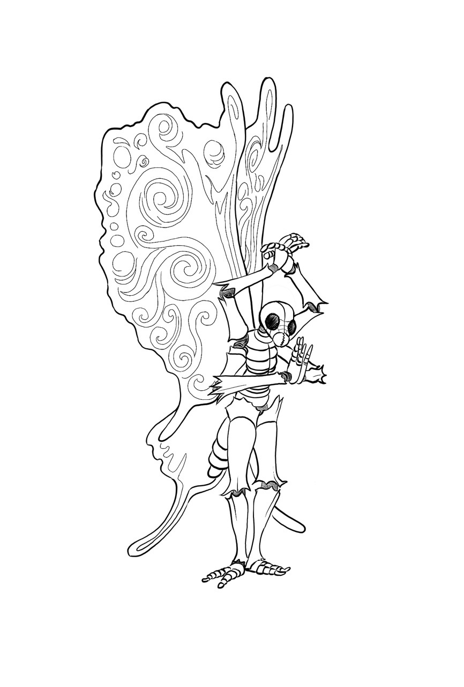

# TFT

# Bestiary 

{{TOC}}

## Aberrations

### wandering eyes

Wandering eyes come in two varieties, the friendly wandering minstrel eye, which are truthful and friendly, and the evil eye which appears friendly but always lies. 

A wandering eye looks like an eye with wings. It has a small mouth and is willing to talk with all travelers sharing stories of what it’s seen. An evil eye will distort, exaggerate, or omit  details create worst possible situation for those it meets. 

- ST 4
- DX 10
- IQ 8
- MA 12 

Wandering eyes have no attacks. They flee from combat if possible. They will beg for mercy offering choice information or favors if freed. Of a course an evil eye will try and use these opportunities against any figure. 

## Beasts

### Basilisk

Petrifying gaze causes all figures in a basilisks front hexes to roll 3d IQ or 2d IQ if figure declares they are averting their eyes. On a save a figure attacks at -2 DX. On a fail a figure begins turning to stone make a 3d ST save next turn to avoid. Failing the second save the victim has turned to stone. This effect only applies to figures who the basilisk can see and does not apply if the basilisk or the the figure is totally obscured for example in darkness.

- ST 22
- DX 13
- IQ 5
- MA 8

Heavy scales stop 2 hits. Bites for 2d. A basilisks powerful jaws are used to crush stone!

### Giant Crab

Giant crabs are amphibious creatures covered in a hard armor like carapace with two large strong claws. 

- ST 

A giant crab can choose to grapple a figure on a successful hit. 

### Giant Spider

Giant 8 legged arachnid. Spiders can climb any surface and cling to walls and ceilings waiting patiently for prey. 

Spiders spin webs they use to catch victims wrapping victims in a web for later consumption. 

Spiders are poisonous.  

- ST 8 - 30
- DX 10
- IQ 4
- MA 10

Spiders range in size from tiny to massive. Spiders that adventurers should worry about start about the size of a dog and  get up to the size of a horse, though some ancient texts describe demon spiders that may have been larger. 

Spiders attack with a web or a bite. 

The web has a range of up to three megahexes. On a successful roll to hit the victim is restrained by sticky webs. Requiring the figure to spend an action and roll 2d ST to break free. While restrained if hit with another web the roll to escape increases by 1d. Another figure may use a bladed weapon to cut a figure free by dealing 5 points to the web, no roll to hit is required. Actions while restrained in a web are at DX -4. 

A spiders bite does 1d-2 to 2d. If damage overcomes armor apply the effects of poison. 

| ST | Bite | Poison | Damage |
|:--|:--|:--|:--|
| 8 | 1d-2  | 2d ST | 1d |
| 10 | 1d-2 | 2d ST | 1d |
| 12 | 1d-1 | 3d ST | 1d+1 |
| 16 | 1d   | 3d ST | 2d-1 |
| 20 | 2d-1 | 4d ST | 2d |
| 24 | 2d   | 4d ST | 3d |

Spider poison deals damage if the save is failed the victim takes the damage listed. Any figure whose ST is reduced to 0 by spider poison is not killed but instead paralyzed for one hour. 

### Hydra

A hydra is a large dragon like creature with 3 or more heads, usually 5. Hydras are most often wingless and live in caves. Historical reports have described winged hydras. 

- ST 25
- DX 12
- IQ 6
- MA 10/16 flying

A typical hydra can attack once with each of its heads for 1d+1. If a hydra takes 5 hits in a turn it loses one head.

Hydras regenerate 2 hits each turn. Every 5 points regenerated replaces 1 head. Damage from fire is not regenerated. 

Some hydras Breath fire. One head can choose to breath fire as a dragon on any turn. On subsequent turns roll 1d6 on a 5 or 6 the hydra is able to use its breath weapon again.

Hydras are rated by the number of heads typically 3 to 7.

| Heads | ST | DX | Armor | Damage | Breath |
|:--|:--|:--|:--|:--|:--|
| 3 | 15 | 11 | 1 | 1d | 1d/ST 1 |
| 4 | 20 | 12 | 2 | 1d+1 | 1d+1/ST 1 |
| 5 | 25 | 13 | 3 | 2d | 1d+2/ST 2 |
| 6 | 30 | 14 | 4 | 2d+1 | 2d/ST 2 |
| 7 | 35 | 15 | 5 | 3d-1 | 3d/ST 3 |

### Shadow cats

Large black cats are panthers made of shadow. They are invisible in shadow or darkness and treat darkness and shadow as light. A shadow cat rolls 4d DX in bright light or sun light. 

- ST 12
- DX 14
- IQ 7
- MA 12

Fur stops 1. Attacks for 1+1 or 1+3 HTH. 

### Wolves

Wolves are canine pack hunters.

- ST 10
- DX 12
- IQ 5
- MA 12

Its bite does 1d+1 damage, and its fur stops 1 hit/attack. On a successful attack the victim must make ST save on 3d or 4d if the wolf is stronger. On a fail the victim falls prone. 

### Dire Wolf 

- ST 16
- DX 13
- IQ 6
- MA 12

Its bite does 2 dice damage. Fur stops 1 hit. On a successful attack the victim must make ST save on 3d or 4d if the wolf is stronger. On a fail the victim falls prone.

## Constructs

### Animated Armor 

Animated suits of plate armor. Created by powerful wizards and used as guardians. Animated armor have limited intelligence and no creative thought process. The armor can be given a five word instruction which it follows to the letter. They can only be reprogrammed via another spell. 

- ST 12-16
- DX 12
- IQ 6
- MA 6

Animated armor will fight with any weapon. Absorbs 5 hits. 

### Doom Guard

Doom guard looks like an empty suit of armor. It is magically animated. A doom guard fights with two long swords. While it might at first seem like a suit of animated armor Doom Guards are intelligent and autonomous. Theories disagree on the nature of the doom guard. Some suggest they are manifestations of dead warriors or wizards, others suggest they were created by a long forgotten spell, and others say they are not from our world. 

- ST 15
- DX 14
- IQ 8
- MA 0/6 teleport

Armor 5 hits. Fights with two broad swords attacking twice each round.

Doom guard can teleport up to 6 hexes in any direction to another location they can see. They never walk.

### Animated Weapon

Animated weapons are enchanted weapons that come in two varieties. The first is inhabited by the spirit of past owner and typically protect a location or guard a treasure. While the second is created by powerful enchantments and are directed by the will of their creator.

An animated weapon can be of any weapon type. They fly through the air attacking perceived enemies. An animated weapon can not be engaged but it can engage a figure. 

- ST 8-16 (hits)
- DX 10
- IQ 8
- MA 10

An animated weapon has hits equal to the ST required to wield that weapon. 

Animated weapons are revealed by the spells Reveal Magic and Analyze Magic, and they ignore images and illusions. Strangely the Reverse Missiles prevents an animated weapon from attacking a Wizard protected by the spell. An animated weapon gets a 4d ST roll against Break Weapon. Dissolve Enchant causes animated weapon cease animating and become a normal weapon again. 

### Golems

A golem is a magical construct created by a Wizard alchemist. They are constructed from various base materials and posses different characteristics dependent on the material.

### Flesh golem

Flesh golems are constructed from the parts taken from the bodies of men. These golems typically look like they were sewn together from parts collected after gruesome battle. 

Flesh golems have an aversion to fire. 

- ST 24
- DX 9
- IQ 6
- MA 8

A flesh golem attacks with it fists 1d+2. It does the same damage in HTH. 

If Flesh golem takes 8 or mores hits in a turn it does not fall down and instead goes berserk. In this state it always attacks the nearest creature mindlessly, it rolls 2d to hit, and attacks against it roll 2d to hit. 

### Clay golem

A clay golem looks like a humanoid made of clay. They are created by alchemists and enchanters. 

- ST 30
- DX 9
- IQ 6
- MA 8

Clay golems attack with its club like fists for 2d-1. 

When a clay golem takes more than 12 points in a round it does not fall but instead goes berserk for the next d6 rounds. It attacks the nearest creature to it or smashes the nearest object if no creatures are within reach, it also makes two attacks each turn the second at -2dx, and it’s MA increases to 10. 

### Stone Golem 

Stone golems are golems made of stone. Creature via a long and complex alchemical enchantment. 

- ST 36
- DX 8
- IQ 6
- MA 7

Stone golems attack with their massive stone fists doing 2d+2. 

Weapons striking a stone golem are prone to breaking. Roll 1d6 after any attack that damages the golem on a 1 the weapon breaks unless it is enchanted. Broken weapons do 1/2 damage.

### Iron Golem

An iron golem is created by strong magic and alchemy in a massive forge. 

- ST 40
- DX 10
- IQ 6
- MA 8

An iron golem is typically forged with a weapon in place of hands. It attacks as a battle axe 3d. 

Iron golems take no damage from fire and are instead healed for half the damage they would have taken. 

An iron golem can breath a cloud of toxic gas in its three front hexes for 1d+1. It can use this ability in addition to its regular attack. On each round after using this ability roll 1d6 on a roll of 1 the golem can use the ability again. 

### clockwork men

Clockwork men are humanoid mechanical constructs made of finely detailed and expertly crafted brass and copper limbs connected  with gears and pistons. Clockwork men stand perfectly still or move in quick precise motions.

Clockwork men as part of their construction are programmed. This programming can be described as a set of instructions they follow to the letter. Reprogramming a clockwork man requires rebuilding it with new instructions in the process. 

Clockwork men can not speak but communicate via head motions and body language. 

They can fight with any weapon but are usually armed with rapiers. 

- ST 9
- DX 15
- IQ 7
- MA 11

Made of metal a clockwork man has natural armor of -5. 

A clockwork man must roll 2d against ST each time they take damage or they have been broken and cease to function. 

## Demons

### Hellhound

A hellhound is a large evil dog. Typically black with red or yellow eyes. 

Hellhounds are more intelligent than regular canines. Often summoned by evil wizards for unsavory tasks. 

A hellhound can breath fire and has a vicious bite. 

- ST 18
- DX 12
- IQ 7
- MA 12

Attack Bite: 2d+1 damage, or breath fire for 2d. After using its breath weapon a hellhound rolls a d6, on a 5 or 6 the breath weapon is rearmed and can be used again. 

A hellhounds fur stops 2 hits. 

### Oculous Demon

The oculous demon is small, 3 foot tall, with a single large eye and bat like wings. These demons have no mouth and can not speak. They have excellent vision, see everything, rarely missing any details in their field of view. 

Used as familiars for wizards willing to take the chance of having a demon familiar. 

- ST 6
- DX 12
- IQ 11

Can cast unnoticability at will, ST 1 +1 per turn after. Mage sight, always on. 

On any turn they can clearly see a figure they can spend 1 ST and cast Know Secret: make an immediate 3d IQ roll, 4d if demon has the higher IQ. On fail the demon knows one secret about the figure. 

### devouring demon 

These demons have a large gaping maw that leads through the internal organs to a plane of hell. You could say they are bigger on the inside. They can eat anything and will eat everything in their path. 

- ST 15
- DX 10
- IQ 6

Attack bite and swallow. 

### Balgor Demon

The Balgor demon appears as a large humanoid with large bat wings. It’s body is skinned with flames dancing constantly dancing over the surface. 

The Balgor fights with a flaming whip in one hand and a flaming sword in the other. 

- ST 30
- DX 14
- IQ 12
- MA 10/16

The Balgor demon attacks as a long sword for 2d + 1d fire. It’s whip has a range 3 to 5 hexes and does 1d-1 + 1d fire damage (special rules for whip applies see ITL page 120.) The Balgor demon may attack once with each weapon in a turn at -4 DX on the second attack. 

HTH with the Balgor demon is dangerous since it’s flaming body inflicts an automatic 2d fire damage to anyone in HTH. In HTH the demon attacks with its clawed hands for 1d+2 + 1d fire. 

### Barbed Demon

Covered in spines poisonous tail sting. 

- ST 30
- DX 14
- IQ 10
- MA 10

Barbed demons attack with claws and their tail stinger. Claws do 2d damage. The tail does 1d+2 if and damage gets through armor the victim also takes 2d poison. The barbed demon can make two attacks in a turn the second attack is -4 DX. In any turn on two successful claw attacks against the same target the barbed demon has pulled the victim into its spiny body and gets an extra 2d damage.

Covered in sharp spines allows the barbed demon to do an automatic 2d damage in HTH. 

## Elementals

### Djinni 

Can grant a wish. Fights with large scimitar. Spell casting. 

- ST 
- DX 
- IQ
- MA

Spells:

### Twig elementals

Twig elementals are chaotic manifestations woodlands gone awry. They look like thorny bundles of sticks and are indiscernible from forest refuse until they move. 

- ST 4
- DX 10
- IQ 6

Attack with thorny branches 1d. 

### Rock Sprites

Rock sprites are small humanoid earth elementals. They are the size of goblins with rocky skin and small black obsidian stones for eyes. They often have more than 2 eyes. 

Rock sprites attack with sharpened stone daggers of flint or obsidian.

- ST 6
- DX 8
- IQ 6

MA 8/6 through earth

Plus 4 more points. 

Rock sprites can move through earth and stone just like they across land. While passing through the earth they can move through an occupied hex. They can not move through  stones cut by men or dwarves think castle walls and floors. A rock sprite may disengage as part of a move by moving through the earth. 

Rock sprites fight with sharpened stones of flint or obsidian. These do 1d-2.

## Humanoids

### Berserkers

As men could be barbarians. They fight rolling 2d on attack attacks against them roll 2d. Berserkers bo not wear armor. 

Stats as per humans

### Hag

Spell casting, invisibility, mimics sounds, makes potions, strikes hard bargains

### Ratmen

Humanoid rats three to four feet tall. They inhabit the sewers of major cities and often have ties to the local thieves guilds. 

- ST 6
- DX 8
- IQ 8
- MA 10

Plus 6 more points.

Ratmen use small weapons typically daggers, cutlass and rapiers. 

### Shadow elves

Slender black skinned elves with black hair. They move in shadows and are most often encountered below ground, above ground at night, or in the deepest darkest of forests. Shadow elves build cities underground where they enslave other races and worship their demon masters. 

Shadow elves are DX -4 in daylight, or in areas of bright light, and suffer x2 effects from dazzle. Shadow elves treat darkness like bright light. They hide easily in shadow or darkness IQ 4d to spot. 

- ST 6
- DX 10
- IQ 8
- MA 10/12 unarmored
- Plus 8 points. 

Shadow elves are natural wizards and often fight with both sword and spell. All shadow elves can cast the following spells regardless of IQ, they standard ST costs:

- Darkness
- Silent Movement

Shadow elf wizards often use the following spells:

- Shadow
- Sleep
- Illusion 
- Invisibility 
- Curse
- Summon Lesser Demon

### Winged men

Winged men are humans with large bird wings. They fly like birds and walk like men. They build villages on mountain peaks and places inaccessible to pedestrians. They avoid working metal, wearing metal, and building with metal, and prefer to deal in gems. 

- ST 8
- DX 8
- IQ 8

MA 10/16*

Plus 4 additional points

* winged men can fly when wearing no more than cloth armor and lightly encumbered. 

Winged men prefer slings, small bows, javelins, and rapiers or other light swords.

## Mutations

### Harpy

A harpy has the body of a large bird with the torso of a woman. A Harpy’s song is beguiling. The harpy can sing a song of persuasiveness that acts as the spell. The harpy and also sing a song of control that acts as a control person. Both abilities cost ST the same as the Wizard spells. 

- ST 10
- DX 12
- IQ 10
- MA 6/16

Harpy’s can attack with their claws for 1d-1. 

### Snaketaur

The body of a large snake ending in the torso of a humanoid. 

- ST 20-30
- DX 12-14
- IQ 8-10
- MA 10

Attack as weapon or bite for 1d + poison. Constriction attack. 

Armor as per any armor worn or 1 hit natural. 

Some snaketaurs have 3, 4, or 6 arms. Allow greater ST and multiple attacks. 

### Snail Hydra

The hydra snail has a large snail like shell and extends 3 to 7 mollusk heads. 

Attacks from behind and the sides must beat the snails shell which protects as plate armor -6 hits.

- ST 24-48 (8 per head)
- DX 8
- IQ 5
- MA 6

Heads can attack any of the front three hexes. 

Each 8 Hits taken removes one head. Snail Hydras can be 1, 2, 3 hex or larger. Consider making a snail hydra 1 hex per 3 heads.

The snail hydra can retreat into it’s shell where it is protected as plate mail from all sides. 

The Snail Hydra can move across all surfaces and climb walls with its sticky monopod. 

### Air Shark

Air sharks are large flying sharks. They swim through the air like sharks swim through water. 

- ST 24-56
- DX 10
- IQ 4

MA 10 flying. It’s skin stops 2 hits. Attack for 2d to 3d. An air Shark can not be engaged it is stays in constant moving forward on each turn. An air Shark has only a single front hex. The air Shark can make a tail attack against any figure in one of its three rear hexes. 

Air sharks ignore engagement and move where they please each turn. They must move each turn! 

### little flying brain with two tentacles 

The flying brain hides out of sight and tries to trick or gain control of sentient creatures so it can drain their ST. Typically using Persuasivenes or Control Person to separate a victim from a group convince them that it is a “friend” and then drain their ST. A Flying Brain might also have animals it has controlled under it’s command. 

- ST 4/12
- DX 14
- IQ 13
- MA 10 flying

Spells:
Confusion, control animal, persuasiveness, control person, telepathy.

Drain ST special attack, as per the spell. 

### Blood sucking vampiric hummingbirds

Colorful birds with long needle like beaks. The can hover in place and change direction quickly. About the size a small dog. They are drawn to warm blooded creatures. They attack by attaching their beaks and draining the victim of blood.

- ST 4
- DX 14
- IQ 5
- MA 16 fly

On a successful hit they attach to a figure and begin sucking blood. The initial attack is as a rapier 1d if any damage gets through they attach and drain 1 point of ST each round without an attack. They will detach and fly away after drawing 3 ST.

### Carbuncle ogre 

A large brutish humanoid with a gem embedded in it head. Carbuncle ogres are prized by wizards for their gem which can be used to make spell storing gems. 

- ST 24
- DX 9
- IQ 7
- MA 10

Use giant club swinging for 3d. While unintelligent the gem in their heads may hold a spell the Ogre can fire off. A spell thrown at the Ogre cast on its hex or mega hex might be absorbed by gem if the ogre makes a IQ 3d roll. On a success the spell has no effect, the Wizard still pays ST, and it is stored in the Ogre’s gem. It can then be fired at the same ST as when it was originally cast. Ogres are not highly intelligent and don’t fully understand their own ability so usually Fire off any spells they hold in a random or haphazard way. 

Carbuncle ogres are sometime recruited and trained by powerful wizards as guardians, who often cast specific spells into the gem. Giving the ogres simple instructions to follow. 

### Chimera 

A lion’s body with three heads, a dragon, lion and goat. Some chimeras have wings and fly. 

- ST 24
- DX 14
- IQ 8
- MA 14/16

Fur stops 1. Attacks 3+1 HTH. The chimera can breath fire like a 1 hex dragon for the cost of 1 ST. It’s goat head can butt as a shield bash, and the lions head bites for 2+1.

### Manticore 

Large lion with a man’s face, large bat wings, and a tail covered in spikes. 

- ST 24
- DX 14
- IQ 8
- MA 16/18

Fur stops 1. Attacks for 2d, or 2+1 HTH. The manticore can strike with it’s tail for 2d at anyone in its rear hexes, or fire a spike from its tail for 2d (like crossbow). 

### Minotaur

A Minotaur has the body of large man and the head of a bull. A Minotaur can use use weapons and armor like man but can also but with its head and horns. 

- ST 16
- DX 10
- IQ 8
- MA 10

Attack as per weapon. Charge and gore must move at least 2 hexes. On a successful hit the the target takes 2d and must make a ST save or be knocked prone. This save is on 4d if the Minotaur has a higher ST. 

### Octorilla 

A large ape with eight octopus like arms. Octorilla are large mutations created by the Wizard alchemist Melvistro. 

- ST 20-32
- DX 14
- IQ 7
- MA 10

Fur stops 2 hit. Attacks with up to four arms in a turn for 1+2. Tries to grapple an opponent or enter HTH. If it grabs an opponent it can rend or use its bite attack for 2d. 

Grab with tentacle vs ST 3d or 4d for two tentacles. A grabbed figure can not move away, but may make another ST check next turn to escape. The octorilla may bite a grabbed figure at +4 for 2d damage.

### Oracles

Oracles are three eyed humanoids with tentacle like limbs. They lack fingers or toes and their limbs and bodies are infinitely flexible like an octopus. They speak telepathically in a confusing array of complex mental imagery.

Oracles are alien beings with with an alien outlook. It is hard if not impossible for humans to understand their motivations they are likely to work with a group of humans and then abandon or attack them unexpectedly later on. 

- ST 8-16
- DX 10-16
- IQ 10-20
- MA 10

Oracles fight with weapons not unlike the weapons used by men. Their highly evolved fighting techniques grant them an extra attack each round. This is like the Two Weapon fighting talent but both attacks happen with the same weapon. The first attack is at the normal DX and the second is -4dx. 

Oracles also have Wizard class who’s use of magic is outside the realms of human understanding works via occult avenues that human wizards have not explored. Oracle wizards pref the following spells: Magic fist, drop weapon, blur, speed movement, shock shield, reverse missiles, reveal/conceal, blast, mage sight, analyze magic, stop, telekinesis, spell shield, teleport.

### Mothmen

Mothmen are humanoid like insects. The can walk on two hind legs and use their other four limbs for other uses. 

Mothmen have large patterned wings which can be very beautiful but can also change color to blend in with the surrounding area. Mothmen can fly when wearing no armor, they can also cling to all but smoothest surfaces. 

Mothmen are often employed as spies special couriers. While they will work for men, dwarves and elves, Mothmen are all beholden to the moth queen. They have a secret society that is not open to outsiders. 

- ST 6
- DX 8
- IQ 8
- MA 8/16 unarmored
- Plus 4 points. 

Mothmen use light swords and daggers, and have been know to use light crossbows, and are masters of poisons. 

### Rock Charger 

Six legged rocky body with no eyes. It has an eye on the end of its tongue. The rock charger looks like boulder or part of the landscape while not moving. 

They wait patiently for prey to come within range before leaping up and charging. They charge blindly hoping to bowl over an opponent which the will bite while they are on the ground. 

- ST 20
- DX 8
- IQ 4
- MA 6/8 charge straight line

It’s tough rock like hide absorbs 3 hits. 

The rock charger lies in wait detecting the footsteps of a victim. It charges at the target with its mouth closed moving through any hex occupied by a smaller creature. Those figures make a 4d ST or are knocked prone. The charger attempts to bite on the next round for 2+1. 

### Shapeshifter/doppelganger 

Shapeshifters are humanoids that can change their appearance to look like another humanoid of the same general size. The are alien in nature with motives unsavory to civilized society. They  often seek to kill and someone they have seen, take on their appearance and use this ruse to find their next victim. 

- ST 12
- DX 10
- IQ 10
- MA 10

The process of change shape requires one full turn, during which the shape shifter can only shift one hex. A shape shifter may assume the form of any creature it can clearly see or has seen. 

Shape shifters use telepathy (as the spell at no cost.) They will use this ability to stalk and better impersonate their victims. 

## Plants

### Dream Flower

A large beautiful flower in amazing colors. The scent is intoxicating. Coming within two megahexes of the flower has the affect of an attract spell. Standing next to the flower and breathing deeply has the affect of sleep spell. 

These flowers attract creatures which fall asleep and are eaten by nearby predators, their carcasses act as fertilizer. 

Dream Flower pollen is a highly valued spell component. It’s fragrance is also valued for expensive perfumes and wines. Alchemist seek out Dream Flowers for poisons and potions. 

### Ent

An ent is tree that has been granted sentience. This can happen after a longer period of growth, enchantment or grant from a god.

Ents can be any variety of tree. Usually showing preference to their species. All ents seek to protect to forest and all who dwell within. They are after friends of eleven. 

- ST 20-40
- DX 8-12
- IQ 8
- MA 6

While motionless an ent is indistinguishable from a normal tree.  An ent swings it’s limbs like massive clubs for 1d per 10 ST. 

An ent takes double damage from fire and have a fear of fire. The also have been known to attack fire users in a rage!

### Zombie flower

The zombie flower grows on a thorny vine. It gives off a sweet aroma that causes confusion and insanity. Anoyone spending three turns within one mega hex of a zombie flower vine must make a 3d IQ check. On a fail the victim becomes alarmed and disoriented thinking everyone around them is any enemy. 

The zombie flower vines grow in the corpses of those that die in its area. These corpses reach and 

## Undead

### Bronze Skull

The bronze skull is a vessel for the spirit of a wizard’s dead apprentice. These are created by powerful necromancers to act as guardians or when they feel they need a little more obedience from an apprentice. 

The bronze skull looks like a bronze skull with smoldering eyes. It can speak and cast the spells it knew in life. A bronze skull is often attached to a door or a wall to act as a gatekeeper or guardian. 

- ST 0 / fatigue 14
- DX 0 / 10
- IQ 14
- MA 0

Spells: any

### Skeletons

Skeletons are the animated bones of the dead. A form of undead summoned by wizards who delve into the dark arts. Skeletons do not think for themselves mindlessly following the orders of their masters. 

Skeletons can be shattered by a hit of 8 points or more from a single blow. 

A skeleton may wear armor and use a variety of weapons. 

Human Skeleton 

- ST 11
- DX 11
- IQ 8
- MA 10

Spear
Sword and shield
Cross bow
Chain mail 
Plate

Lion skeleton
Dragon skeleton 

### Haunting Miasma

The haunting miasma appears as a roiling black cloud. The faces of its victims appear and disappear in the mist their faces screaming in agony and fear. A faint sound of wailing despair seems to come from deep in the cloud. 

The haunting miasma is a cloud typically 3 hexes in size. When it moves it must always move so that it’s three hexes are contiguous. 

The haunting miasma can not be engaged or engage a figure. It can not be engaged in HTH combat. It can move into a hex occupied by another figure. It can move a6 half speed through narrow spaces like under doors or through a pipe or grate. 

- ST
- DX
- IQ
- MA

The haunting miasma is made of smoke and shadows each hex it occupies counts as a shadow hex and any figure in one of these hexes counts darkness. 

Any figure in a hex occupied by the haunting miasma takes 1d ST (armor does not prevent this damage)as they choke on the fumes and feel the cloud drain their strength. No attack roll is needed. 

The haunting miasma is vulnerable to light. Swing a torch deals damage as per a club. 

A lantern can be focused on the cloud to cause 1d damage. This requires a roll to hit with range mods as per a thrown weapons. 

Normal weapons have no effect on the cloud. Silvered or magic weapons do half damage.

Made of smoke and shadows the haunting miasma takes damage from light spells and strong gusts of wind. 

Magic is sometimes effective.

- Light spell - 1d per turn
- Dazzle inflict 2d
- Lightning, Fire, and fireball, do normal damage
- Rainstorm does 1d damage per turn
- Fresh air does 3d 
- Illusions may have an effect at GM discretion 

### Wich

The Wich is a powerful undead Wizard with the head and hands of of a beautiful woman and a skeletal body. Usually they conceal their bodies to hide their true nature since from the neck up they look like a regular human. 

Wich’s are true manipulators directing their minions to further their nefarious aims. 

- ST 8/16
- DX 12+
- IQ 16+
- MA 10

Spells include: Presuasion, Telepathy, Control Person, Create Zombie, ...

### Shadow

A shadow is a humanoid made of shadow. Shadows are invisible while in shadow. They can slip through any space connected by shadows for example under doors, or through narrow spaces. A shadow cannot traverse a well lit space. 

Roll IQ 4d to spot a shadow in shadows or darkness. 

- ST 
- DX 
- IQ 
- MA 10

Shadows are mostly non corporeal and cannot lift carry or move corporeal objects. A shadows non-corporeal nature’s means it takes half damage from physical attacks, though it takes full damage from magic or enchanted weapons. They attack by draining ST from living beings. Their attacks ignore non magic armor. 

Shadows attack for 1d-1 ST. Damage is temporary, as per Wizard fatigue. A figure reduced to 0 ST by a shadow becomes a shadow!

### Gelatinous Mass

